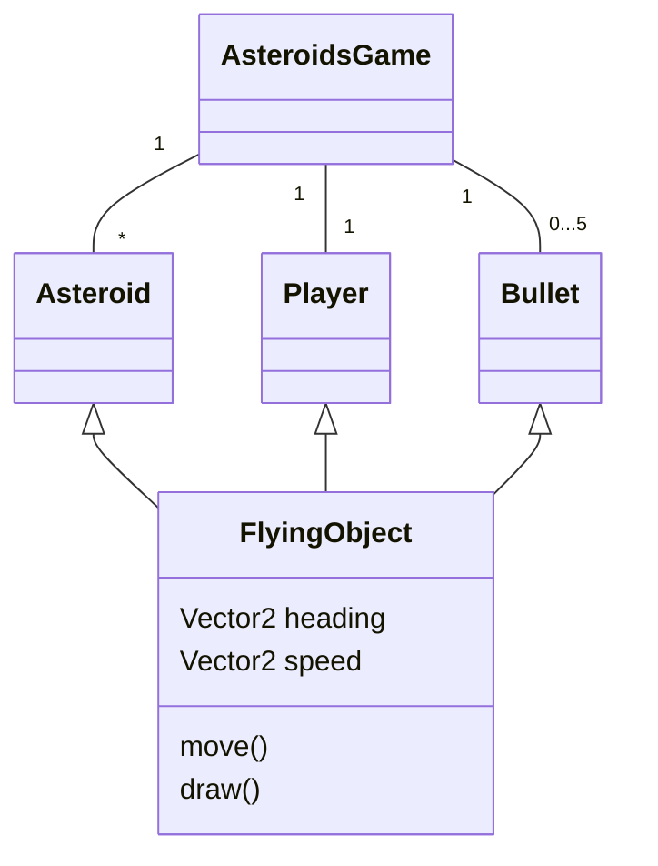
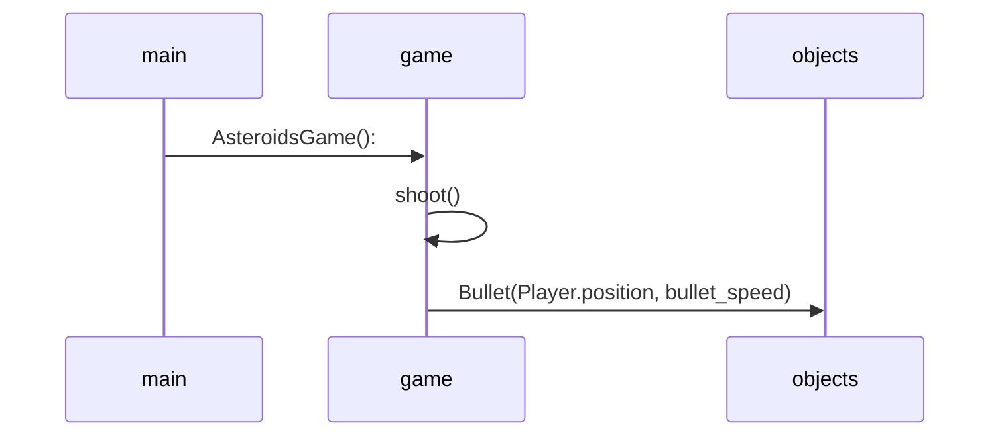

# Arkkitehtuurikuvaus
## Rakenne
Ohessa kuvattu rakenne luokkakaaviona

## Päätoiminnallisuudet 
Ohessa pelin keskeiset toiminallisuudet kuvattuna sekvenssikaaviona
### Ampuminen

Onkohan pelin rakenne jotenkin todella vaikea, jos on vaikeuksia luoda mielekästä sekvenssikaaviota toiminnallisuuksista?
