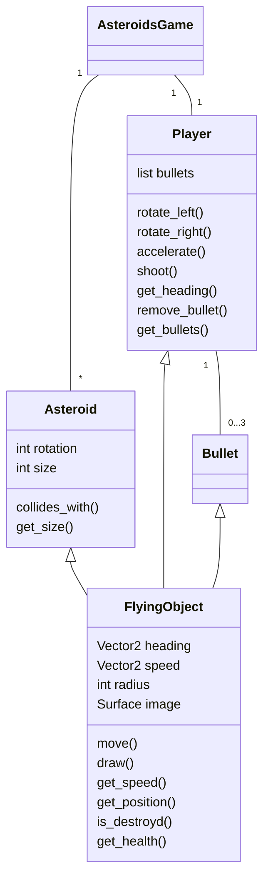
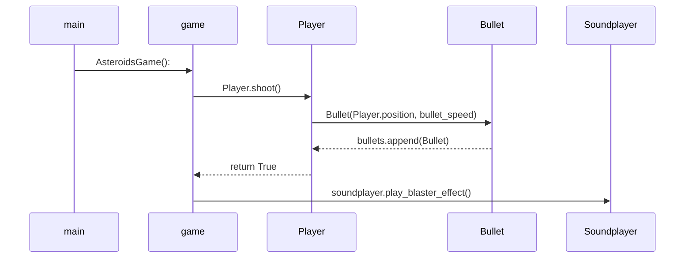

# Arkkitehtuurikuvaus
## Rakenne
Ohjelman rakenne noudattelee kolmitasoista kerrosarkkitehtuuria, ja koodin pakkausrakenne on seuraava:

Pakkaus ui sisältää käyttöliittymästä, services sovellus-/pelilogiikasta sekä äänistä ja repositories tietojen pysyväistallennuksesta vastaavan koodin. Pakkaus entities sisältää luokkia, jotka kuvastavat sovelluksen käyttämiä tietokohteita. Lisäksi pelin tiedon pysyväistallennus on toteutettu pakkauksen data sisällä sijaitsevaan tiedostoon.

## Käyttöliittymä
Käyttöliittymä sisältää neljä erillistä näkymää:

- Päävalikko
- Huippupisteet
- Näppäimet
- Pelin pysäytysikkunan
- Pelaajan nimen/nimimerkin syöttäminen (pisteiden tallennusta varten)

Jokainen näistä näkymistä on toteutettu omana luokkanaan. Peli avautuu päävalikkoon. Päävalikosta voidaan siirtyä joko huippupiste- tai näppäimet-näkymiin, käynnistää uusi pelitapahtuma tai poistua kokonaan pelistä. Näkymistä yksi on aina kerrallaan esillä, ellei varsinainen pelitapahtuma ole aktiivisena. Näkymien näyttämisessä hyödynnytään AsteroidsGame-luokan piirtometodeja. 

Kun pelin tilanne muuttuu, eli uusi peli käynnistetään, kutsutaan AsteroidsGame luokan metodia star_new_game() joka asettaa uuden pelin aloitusmuuttujat oletusarvoonsa ja asettaa pelitapahtuman aktiiviseksi, jolloin valikoita ei enää näytetä. Pelitapahtuman päätyttyä palataan pelaajan nimen syöttämisen kautta päävalikkoon.

Käyttöliittymä on pyritty eristämään pääosin sovelluslogiikasta, valikot ainoastaan kutsuvat AsteroidsGame-luokan metodeja. Itse pelitapahtuman käyttöliittymä on vielä yhdessä sovelluslogiikan kanssa, ja olisi hyvä korjata erilliseksi myöhemmissä versioissa.

Käyttöliittymä on haluttu toteuttaa ulkoasultaan ja navigoinniltaan retrohenkisesti, joten liikkuminen on tapahtuu ainoastaan näppäimistökomennoilla.

## Sovellus-/pelilogiikka
Sovelluksen keskeisen logiikan muodostavat AsteroidsGame, Player, Asteroid (Large, Medium, Small) sekä Bullet luokat, jotka kuvaavat pelitapahtumiin osallistuvia olioita ja niiden välisiä vuorovaikutuksia:

AsteroidsGame huolehtii pelitilanteen päivittämisestä ja muut edellä mainitut luokat huolehtivat pelissä olevien objektien ominaisuuksista.

## Tietojen pysyväistallennus
Kunkin pelin pisteet sekä pelaajan syöttämä nimi/lempinimi tallenetaan CSV-muodossa data pakkauksen sisällä olevaan tiedostoon, jotta parhaita pisteitä voidaan tarkastella myöhemmin. Pisteistä näytetään pyydettäessä järjestettynä kymmenen parasta valikossa High Scores. Tallennustiedoston nimeä on mahdollista muuttaa.

Pakkauksen repositories luokka HighScoresRepository huolehtii tietojen tallettamisesta ja lukemisesta. Tämä mahdollistaa myös muut tietokantarakenteet myöhemmin.

## Päätoiminnallisuudet 
Ohessa pelin keskeiset toiminallisuudet kuvattuna
### Pelin käynnistäminen 
Peli voidaan käynnistää päävalikosta valitsemalla, eli siirtämällä avaruusalus kohdalle "New Game". Tämä alustaa ja käynnistää uuden pelitapahtuman. 

### Parhaiden pisteiden tarkastelu
Aiempien pelien kymmenen parasta pistettä näytetään High Scores valikossa. Valikkoon pääsee siirtämällä avaruusaluksen päävalikossa kohtaan "High Scores".

### Pelin pysäyttäminen
Pelitapahtuma on mahdollista pysäyttää jos tilanne alkaa käydä liian hengästyttäväksi painamalla ESC-näppäintä pelin aikana. Tällöin peli pysäytetään ja näytetään pysäytysvalikko. Pysäytysvalikosta voi palata hengityksen tasaannuttua jatkamaan peliä, tai poistua päävalikkoon, jos vauhti kävi liian hurjaksi.

### Oman tuloksen tallentaminen
Kun pelaajan energiapisteet loppuvat, peli loppuu. Tällöin siirrytään näkymään, jossa pelaaja voi syöttää oman nimensä/nimimerkkinsä ja hänen saamansa pisteet tallenetaan. Pelaajan syötteen tulee olla 1-20 merkkiä pitkä, muita syötteitä ei hyväksytä. Mikäli pelaaja ei syötä mitään ja painaa ESC-näppäinätä tallenetaan hänen tuloksena nimimerkillä "Unnamed Captain Star".

### Ampuminen
Pelaaja voi tietenkin ampua vaarallisia asteroideja. Tämä tapahtuu pelitapahtuman aikana painamalla SPACE-näppäintä. Alus ampuu tällöin ammuksen aluksen keulan osoittamaan suuntaa, mikäli peli-ikkunassa ei ole jo kolmea ammusta samanaikaisesti.

Alla havainnollistus sekvekssikaaviolla ampumatapahtumasta

