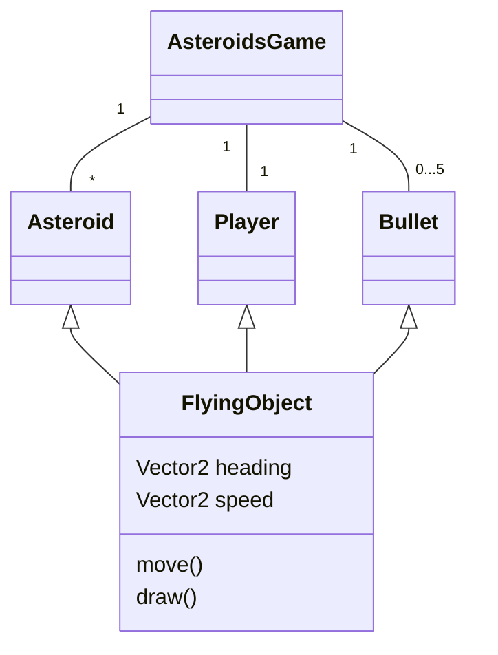
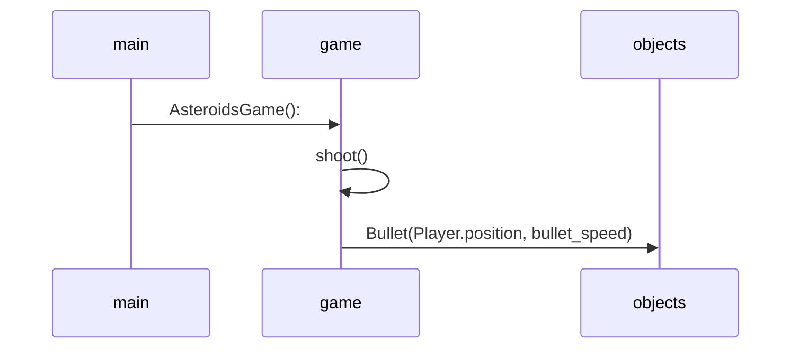

# Arkkitehtuurikuvaus
## Rakenne
Ohjelman rakenne noudattelee kolmitasoista kerrosarkkitehtuuria, ja koodin pakkausrakenne on seuraava:

Pakkaus ui sisältää käyttöliittymästä, services sovellus-/pelilogiikasta ja repositories tietojen pysyväistallennuksesta vastaavan koodin. Pakkaus entities sisältää luokkia, jotka kuvastavat sovelluksen käyttämiä tietokohteita.

## Käyttöliittymä
Käyttöliittymä sisältää neljä erillistä näkymää:

- New game
- High scores
- Help
- Pause screen

Jokainen näistä on toteutettu omana luokkanaan. Näkymistä yksi on aina kerrallaan näkyvänä, ellei varsinainen pelitapahtuma oli aktiivisena. Näkymien näyttämisestä vastaa AsteroidsGame-luokka. Käyttöliittymä on pyritty eristämään pääosin sovelluslogiikasta. Se ainoastaan kutsuu AsteroidsGame-luokan metodeja.

Kun pelin tilanne muuttuu, eli uusi peli käynnistetään, kutsutaan sovelluksen metodia initialize_game joka asettaa uuden pelin aloitusmuuttujat oletusarvoonsa ja asettaa pelitapahtuman aktiiviseksi, jolloin valikoita ei enää näytetä.

## Sovellus-/pelilogiikka
Sovelluksen keskeisen logiikan muodostavat AsteroidsGame, Player, Asteroid (Large, Medium, Small) sekä Bullet luokat, jotka kuvaavat pelitapahtumiin osallistuvia olioita ja niiden välisiä vuorovaikutuksia:

AsteroidsGame huolehtii pelitilanteen päivittämisestä ja muut edellä mainitut luokat huolehtivat pelissä olevien objektien ominaisuuksista.

## Tietojen pysyväistallennus
Peliin tullaan viimeisessä vaiheessa lisäämään tietojen tallennus, jotta parhaat pisteet saadaan talteen ja niitä voidaan tarkastella myöhemmin.

Pakkauksen repositories luokka HighScoresRepository huolehtii tietojen tallettamisesta. Tiedosto/tietokantarakenne valitaan projektin viimeisellä viikolla.

## Päätoiminnallisuudet 
Ohessa pelin keskeiset toiminallisuudet kuvattuna sekvenssikaaviona
### Pelin käynnistäminen 

### Parhaiden pisteiden tarkastelu

### Pelin pysäyttäminen

### Oman tuloksen tallentaminen

### Ampuminen

Onkohan pelin rakenne jotenkin todella vaikea, jos on vaikeuksia luoda mielekästä sekvenssikaaviota toiminnallisuuksista?
