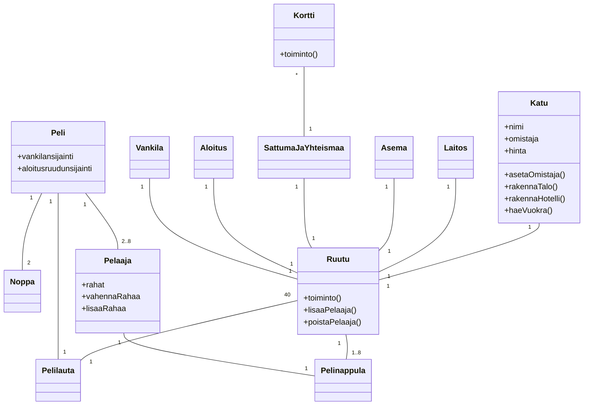

```mermaid
classDiagram
	Peli "1" -- "1" Pelilauta
	Peli "1" -- "2" Noppa
	Peli "1" -- "2..8" Pelaaja
	Ruutu "40" -- "1" Pelilauta
	Vankila "1" -- "1" Ruutu
	Aloitus "1" -- "1" Ruutu
	SattumaJaYhteismaa "1" -- "1" Ruutu
	Asema "1" -- "1" Ruutu
	Laitos "1" -- "1" Ruutu
	Katu "1" -- "1" Ruutu
	Kortti "*" -- "1" SattumaJaYhteismaa
	Pelaaja "1" -- "1" Pelinappula
	Ruutu "1" -- "1..8" Pelinappula
	class Ruutu {
		+toiminto()
		+lisaaPelaaja()
		+poistaPelaaja()
	}
	class Katu {
		+nimi
		+omistaja
		+hinta
		+asetaOmistaja()
		+rakennaTalo()
		+rakennaHotelli()
		+haeVuokra()
		
	}
	class Peli {
		+vankilansijainti
		+aloitusruudunsijainti
	}
	class Kortti {
		+toiminto()
	}
	class Pelaaja {
		+rahat
		+vahennaRahaa
		+lisaaRahaa
	}
```
