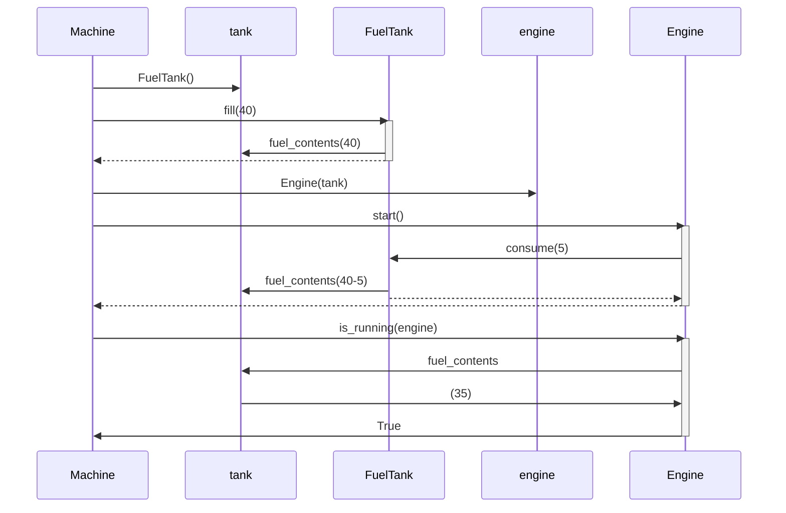

```mermaid
sequenceDiagram
	Machine->>tank: FuelTank()
	Machine->>FuelTank: fill(40)
	activate FuelTank
	FuelTank->>tank: fuel_contents(40)
	FuelTank-->>Machine: 
	deactivate FuelTank
	Machine->>engine: Engine(tank)
	Machine->>Engine: start()
	activate Engine
	Engine->>FuelTank: consume(5)
	FuelTank->>tank: fuel_contents(40-5)
	FuelTank-->>Engine: 
	Engine-->>Machine: 
	deactivate Engine
	Machine->>Engine: is_running(engine)
	activate Engine
	Engine->>tank: fuel_contents
	tank->>Engine: (35)
	Engine->>Machine: True
	deactivate Engine
```
